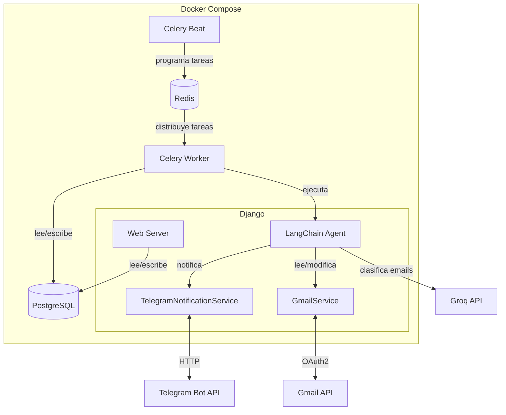
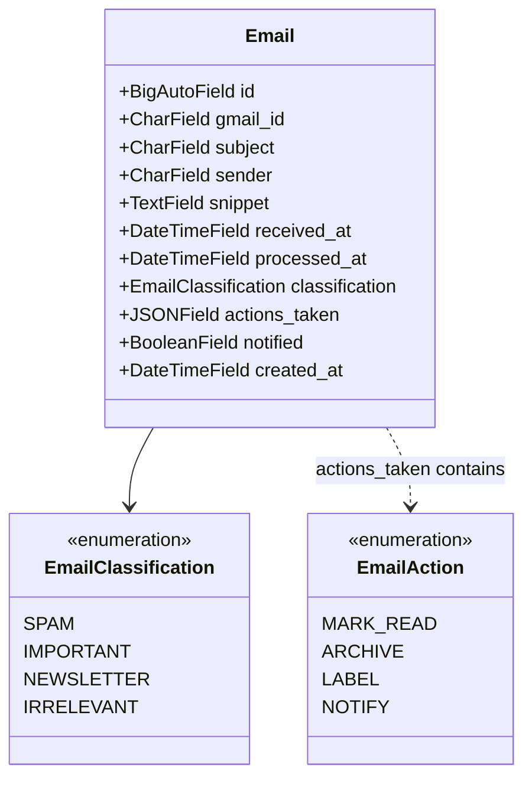
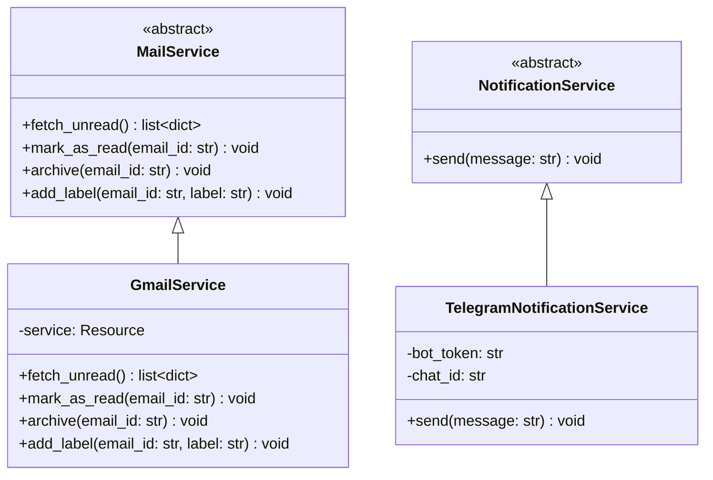
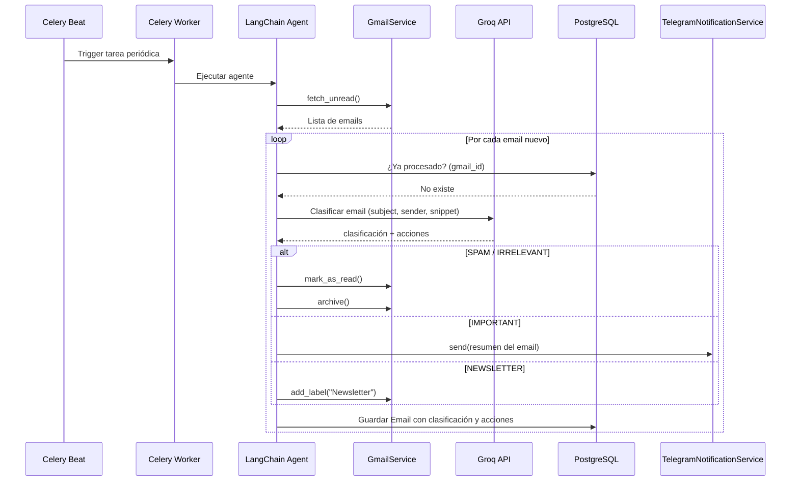

# Arquitectura

## Diagrama de servicios

```mermaid
graph TB
    subgraph Docker Compose
        subgraph Django
            Web[Web Server]
            Agent[LangChain Agent]
            GS[GmailService]
            TNS[TelegramNotificationService]
        end

        Worker[Celery Worker]
        Beat[Celery Beat]
        Redis[(Redis)]
        DB[(PostgreSQL)]
    end

    Gmail[Gmail API]
    Groq[Groq API]
    TG[Telegram Bot API]

    Beat -- programa tareas --> Redis
    Redis -- distribuye tareas --> Worker
    Worker -- ejecuta --> Agent
    Agent -- clasifica emails --> Groq
    Agent -- lee/modifica --> GS
    Agent -- notifica --> TNS
    GS <-- OAuth2 --> Gmail
    TNS <-- HTTP --> TG
    Web -- lee/escribe --> DB
    Worker -- lee/escribe --> DB
```

## Modelo de datos

```mermaid
classDiagram
    class Email {
        +BigAutoField id
        +CharField gmail_id
        +CharField subject
        +CharField sender
        +TextField snippet
        +DateTimeField received_at
        +DateTimeField processed_at
        +EmailClassification classification
        +JSONField actions_taken
        +BooleanField notified
        +DateTimeField created_at
    }

    class EmailClassification {
        <<enumeration>>
        SPAM
        IMPORTANT
        NEWSLETTER
        IRRELEVANT
    }

    class EmailAction {
        <<enumeration>>
        MARK_READ
        ARCHIVE
        LABEL
        NOTIFY
    }

    Email --> EmailClassification
    Email ..> EmailAction : actions_taken contains
```

## Services

```mermaid
classDiagram
    class MailService {
        <<abstract>>
        +fetch_unread() list~dict~
        +mark_as_read(email_id: str) void
        +archive(email_id: str) void
        +add_label(email_id: str, label: str) void
    }

    class GmailService {
        -service: Resource
        +fetch_unread() list~dict~
        +mark_as_read(email_id: str) void
        +archive(email_id: str) void
        +add_label(email_id: str, label: str) void
    }

    class NotificationService {
        <<abstract>>
        +send(message: str) void
    }

    class TelegramNotificationService {
        -bot_token: str
        -chat_id: str
        +send(message: str) void
    }

    MailService <|-- GmailService
    NotificationService <|-- TelegramNotificationService
```

## Flujo de procesamiento

```mermaid
sequenceDiagram
    participant Beat as Celery Beat
    participant Worker as Celery Worker
    participant Agent as LangChain Agent
    participant Gmail as GmailService
    participant Groq as Groq API
    participant DB as PostgreSQL
    participant TG as TelegramNotificationService

    Beat->>Worker: Trigger tarea periódica
    Worker->>Agent: Ejecutar agente
    Agent->>Gmail: fetch_unread()
    Gmail-->>Agent: Lista de emails

    loop Por cada email nuevo
        Agent->>DB: ¿Ya procesado? (gmail_id)
        DB-->>Agent: No existe

        Agent->>Groq: Clasificar email (subject, sender, snippet)
        Groq-->>Agent: clasificación + acciones

        alt SPAM / IRRELEVANT
            Agent->>Gmail: mark_as_read()
            Agent->>Gmail: archive()
        else IMPORTANT
            Agent->>TG: send(resumen del email)
        else NEWSLETTER
            Agent->>Gmail: add_label("Newsletter")
        end

        Agent->>DB: Guardar Email con clasificación y acciones
    end
```
